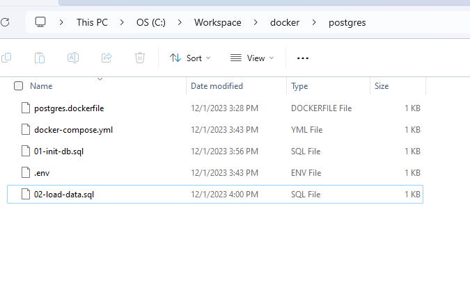
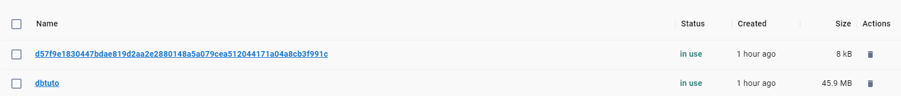

# Content

1. [Chapter 1: Setup Postgres](#chapter1)
  - [Chapter 1 - Part 1: Example to Setup a Local Postgres Database using Docker](#chapter1part1)
  - [Chapter 1 - Part 2: Access Postgres Database from Docker and Make your first Query](#chapter1part2)

## <a name="chapter1"></a>Chapter 1: Setup Postgres

#### <a name="chapter1part1"></a>Chapter 1 - Part 1: Example to Setup a Local Postgres Database using Docker

For this example, all files to setup the Postgres in docker is located in the folder [docker-example](https://github.com/vitorstabile/postgresql-basics/tree/main/docker-example). Just download and make the command ```docker-compose up -d``` after copy the configuration in ```env.txt``` and create a new ```.env``` file and paste the config. This tutorial bellow, is just to explain how to configure a Postgres image and run

First, to start a Postgres database in a docker container, we have to create a Dockerfile.

Create the Dockerfile in a directory

<br>

<div align="center"><br><sub>Dockerfile - (<a href='https://github.com/vitorstabile'>Work by Vitor Garcia</a>) </sub></div>

<br>

```
FROM postgres:15.1-alpine

LABEL author="Your Name"
LABEL description="Postgres Image for demo"
LABEL version="1.0"

COPY *.sql /docker-entrypoint-initdb.d/
```

Note that the line ```COPY``` below will copy all the sql files in our source folder, where we have our Dockerfile, and add them in the ```/docker-entrypoint-initdb.d/```

This folder in your Postgres container is where you can add additional initialization scripts (creating the directory if necessary).

**Create a docker-compose file**

Once you have created your docker file, now to run the Postgres container in a clean way, you can create a docker-compose.yml file.

```
services:
  postgres:
    build:
      context: .
      dockerfile: postgres.dockerfile
    image: "postgres-tutorials"
    container_name: ${PG_CONTAINER_NAME}
    environment:
      POSTGRES_DB: ${POSTGRES_DB}
      POSTGRES_USER: ${POSTGRES_USER}
      POSTGRES_PASSWORD: ${POSTGRES_PASSWORD}
      PGDATA: ${PGDATA}
    volumes:
       - dbtuto:/data/postgres-tuto
    ports:
      - "5432:5432"
    restart: unless-stopped
volumes:
    dbtuto:
      external: true
```

The values which are in this form ```${PG_CONTAINER_NAME}``` have been defined in an env file; to be managed easily. To do so, create a ```.env``` file in your source folder and add all the environment variables, like below.

```
PG_CONTAINER_NAME='postgres_tuto'
POSTGRES_USER='tuto'
POSTGRES_PASSWORD='admingres'
POSTGRES_DB='tutos'
PGDATA='/data/postgres-tuto'
```

***Create SQL scripts files***

Now that our compose file is ready, we can create our SQL scripts file that must be copied in ```/docker-entrypoint-initdb.d/```

File: ```01-init-db.sql```

```
-- CREATE TYPE
DROP TYPE IF EXISTS genre;
CREATE TYPE genre AS ENUM (
    'ADVENTURE',
    'HORROR',
    'COMEDY',
    'ACTION',
    'SPORTS'
);

-- CREATE TABLE
DROP TABLE IF EXISTS movies;
CREATE TABLE movies (
    id SERIAL PRIMARY KEY,
    title VARCHAR NOT NULL,
    release_year SMALLINT,
    genre genre,
    price NUMERIC(4, 2)
);
```

File: ```02-load-data.sql```

```
-- LOAD DATAS
INSERT INTO movies(id, title, release_year, genre, price)
VALUES
    (1, 'The Shaw shank Redemption', 1994, 'HORROR', 15.99),
    (2, 'Ant Man', 2019, 'ADVENTURE', 15.00),
    (3, 'Fallen', 1996, 'HORROR', 23.99),
    (4, 'The barbershop', 2006, 'COMEDY', 6.50),
    (5, 'The last dance', 2021, 'SPORTS', 55.99),
    (6, 'Peter Pan', 2004, 'ADVENTURE', 15.99),
    (7, 'Fast & Furious 7', 2018, 'ACTION', 36.00),
    (8, 'Harry Potter', 2000, 'ACTION', 26.50),
    (9, 'Jungle book', 2004, 'ADVENTURE', 25.00);
```

We start the names of those 2 files with ```01-*``` and ```02-*``` because these initialization files will be executed in sorted name. So we want the database to be created first, then load the data.

<br>

<div align="center"><br><sub>All Files - (<a href='https://github.com/vitorstabile'>Work by Vitor Garcia</a>) </sub></div>

<br>

***Run our Postgres container***

Before running our Postgres container, we have specified in our docker-compose file that we will use an external volume.

```
# Here ↓
volumes:
    dbtuto:
      external: true
```

So in other to have an external volume we have to create it:

```
docker volume create dbtuto
```

Now we can launch our Postgres database with docker compose:

```
docker-compose up -d
```


OBS: This Docker image of Postgres will create another random volume, different from the dbtuto, creating in total two volumes. 


<br>

<div align="center"><br><sub>Two Volumes - (<a href='https://github.com/vitorstabile'>Work by Vitor Garcia</a>) </sub></div>

<br>

This happens when the image you are using defines a VOLUME in the Dockerfile to a container path that you do not define as a volume in your run command. Docker creates the guid for the volume name when you have a volume without a source, aka an anonymous volume. You can use docker image inspect on the image to see the volumes defined in that image. If you inspect the container (docker container inspect), you'll see that your volume is being used, it's just that there's a second anonymous volume to a different path also being used.

#### <a name="chapter1part2"></a>Chapter 1 - Part 2: Access Postgres Database from Docker and Make your first Query

After made the ```docker-compose up -d```, the container was created. Make a ```docker ps``` to list the container and get the container id

```
CONTAINER ID   IMAGE                        COMMAND                  CREATED          STATUS          PORTS                                       NAMES
31354b0e9801   postgres-tutorials           "docker-entrypoint.s…"   6 seconds ago    Up 6 seconds    0.0.0.0:5432->5432/tcp, :::5432->5432/tcp   postgres_tuto
```

Now, make the comand ```docker exec -it 31354b0e9801 bash``` to enter in the container

After that, make the command ```psql --version``` to display the version of Postgres. In this case, needs to be

```
psql (PostgreSQL) 15.1
```

Now, let´s enter in the database ```tutos```.

To enter in the Postgres, we need to make this command ```psql -d database_name -U username```

Make the command ```psql -d tutos -U tuto```

Now, let´s list the databases. Use the command ```\l```

```
   Name    | Owner | Encoding |  Collate   |   Ctype    | ICU Locale | Locale Provider | Access privileges
-----------+-------+----------+------------+------------+------------+-----------------+-------------------
 postgres  | tuto  | UTF8     | en_US.utf8 | en_US.utf8 |            | libc            |
 template0 | tuto  | UTF8     | en_US.utf8 | en_US.utf8 |            | libc            | =c/tuto          +
           |       |          |            |            |            |                 | tuto=CTc/tuto
 template1 | tuto  | UTF8     | en_US.utf8 | en_US.utf8 |            | libc            | =c/tuto          +
           |       |          |            |            |            |                 | tuto=CTc/tuto
 tutos     | tuto  | UTF8     | en_US.utf8 | en_US.utf8 |            | libc            |
```

Now, to use the database ```tutos``` make 

```
\c tutos
```

```
You are now connected to database "tutos" as user "tuto".
```

Now, let´s list the tables in the database tutos

```
\dt
```

```
        List of relations
 Schema |  Name  | Type  | Owner
--------+--------+-------+-------
 public | movies | table | tuto
(1 row)
```

Now, let´s make a simple SELECT

```
SELECT * FROM movies;
```

```
 id |           title           | release_year |   genre   | price
----+---------------------------+--------------+-----------+-------
  1 | The Shaw shank Redemption |         1994 | HORROR    | 15.99
  2 | Ant Man                   |         2019 | ADVENTURE | 15.00
  3 | Fallen                    |         1996 | HORROR    | 23.99
  4 | The barbershop            |         2006 | COMEDY    |  6.50
  5 | The last dance            |         2021 | SPORTS    | 55.99
  6 | Peter Pan                 |         2004 | ADVENTURE | 15.99
  7 | Fast & Furious 7          |         2018 | ACTION    | 36.00
  8 | Harry Potter              |         2000 | ACTION    | 26.50
  9 | Jungle book               |         2004 | ADVENTURE | 25.00
```
